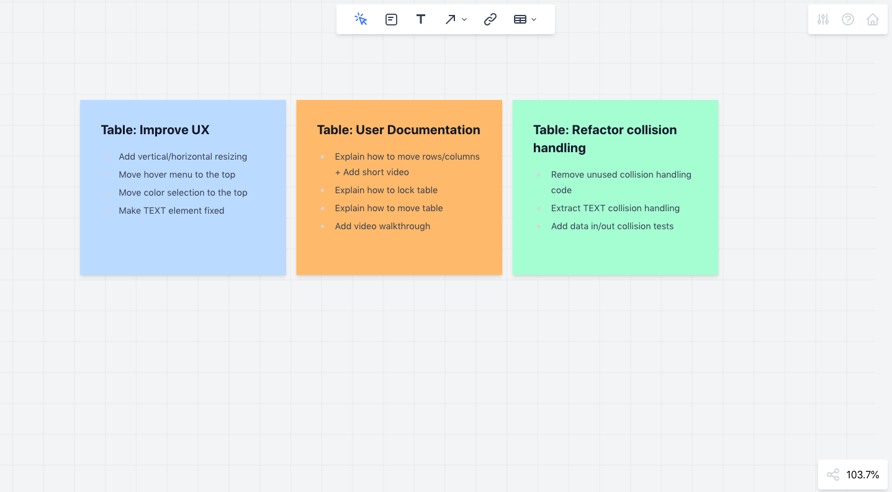
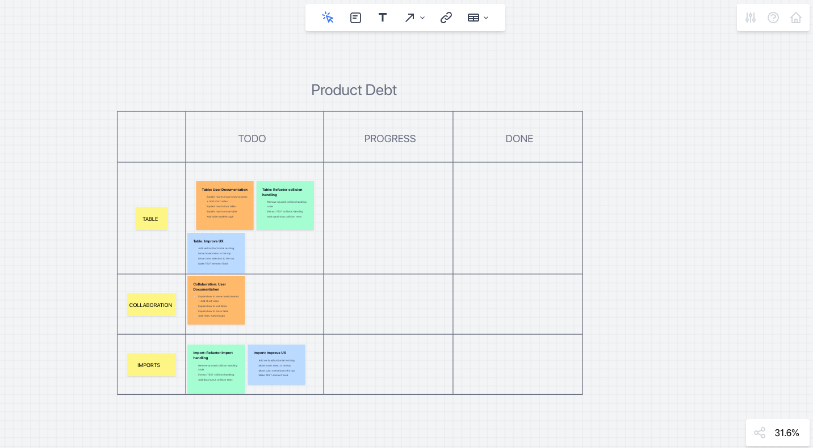
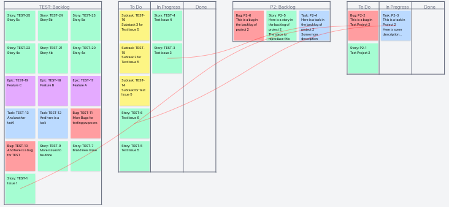

# Paperboard - Product Debt

In this week's blog post, we want to talk about a topic we like to call **"Product Debt"**. Said topic might be more commonly referred to as **Technical Debt** and commonly pops up when it comes to talking about product and engineering and what to build next.

Before we get into more detail about product debt, let's talk about technical debt first.

When writing code, we mostly need to keep a couple of things in mind things, i.e.: _maintainability_, _updating dependencies_, _ensuring not blocking future development_ and other activities with long term implications.
Sometimes we make a deliberate trade-off between getting a feature out via the cost of neglecting some of the above mentioned aspects. Over time, these trade-offs from shipping faster accumulate debt, technical debt, which leads to a slower development process in the long run. This is when a product and/or engineering team needs to make deliberate decisions on how much debt to payback and when.

But if we think about this from a product perspective there is more to consider, because **technical debt might have a delayed effect from a user perspective**. Engineering will feel the effects of technical debt first, due to having to daily interact with the technical implications of previous decisions. For the user this debt might not be noticible yet.

So interestingly it's not enough to talk about technical debt from a product perspective, because **suboptimal UX**, **inconsistent design** or **missing documentation** have effects on user land. Where do things like a **missing FAQ entry** or **half documented feature in the user handbook** fall in this?

To get a **better understanding of product debt** here are some **questions** that we could ask:

- _What processes or tools are used to understand the value features provide?_
- _Is there an understanding which features provide low or no value?_
- _Are low level features removed from the product?_
- _How is suboptimal ux identified and handled?_
- _How are desgin inconsistencies tackled?_
- _Is there an explicit way how ux, design or product inefficiencies are handled?_

These questions might help to gain a more tangible approach to identifying product debt. Both, with technical and product debt, the debt can accumulate very slowly, almost unnoticed from the day to day business.

Product debt happens through business, product, marketing, design, ux, technical decisions etc. or a combination of these. The lag between these decisions and the effects they could have might be large, nonetheless there are techniques and ways to not neglect the topic.

While building Paperboad we make decisions revolving around **_shipping a feature to get quick feedback_** and ensuring we can keep constantly shipping in the future. To get a better insight of the scope for a specific feature, we might build out a **_rudimentary technical implementation with minimal UX_**, just to see how this would work and what blockers one might run into.
After rolling out the feature we start tracking what's missing from a product perspective, for example we might create a card with **"Feature A: Write user documentation"** or **"Feature A: Improve UX"**, which might contain a list of things to improve.

These cards alone might disappear in the workspace, out of sight - out of mind. This is where a board can come handy, we can collect these issues and place them somewhere prominently on the board. But it doesn't have it to be a board, it can just as well be tracked in your usual product management application. This only a matter of preference.

One approach when using is the board is to group these issues by topic and color, i.e. blue for UX and green for technical fixes and so forth. Being able to collect these issues helps getting a better idea of the currently occurred product debt. Obviously we use Paperboard itself to track the debt. Here is an example of how we would use this. In this case we just a regular **table element** containing topics and issues. This table exists outside of any cycle or iteration, it is always present and anyone can take an issue and work on it. The table is always visible, placed at a central position on the board.

One interesting aspect that we are trying to introduce is **visualizing the dependencies between issues**. For example some issues can not be tackled due other issues needing to be finished first. In a future version, you can see which cards are blocked, which can give a more detailed picture of how much work needs to be done. Here is a demo preview of the dependencies feature:

From an engineering perspective it can be frustrating not being able to make a case for refactoring, especially in environments where a _feature factory_ mindset is prevalent. When engineering has to shoulder the debt in most cases without having the ability to tackle these issues when needed, is where a **collective understanding** is more needed than not. It can help to get a collective sense of the current situation by talking about **Product Debt**, as these technical issues have an effect on the product and the user experience.

These are possible steps we can take to address the issue:

- **Make the debt visible**
- **Discuss the debt and weigh off between the possible options and their effects**
- **Keep incrementaly tackling issues!**

It's normal that product debt occurrs, especially because we want to ship quickly to better understand the problem and get feedback. Based on that feedback we can make further decisions or neglect the feature. What mostly happens is that we **build features**, **ship** them and **forget** about these features due to time constraints. More new features waiting to be delivered. This is especially true in the early product phase.

Thinking about **Product Debt**, no matter if it is design, product, tech, ux or content related, helps not lose sight of the impact of product decisions on the actual user.

## Follow our Development

You can follow our progress on our own Paperboard board at [paperboard.app/dev](https://paperboard.app/dev).

This is a readonly snapshot of our development board.

You can also follow us on twitter at [twitter.com/paperboardapp](https://twitter.com/paperboardapp).

## Try Paperboard

You can try Paperboard yourself right now at [paperboard.app](https://paperboard.app).

Let us know what you think.
