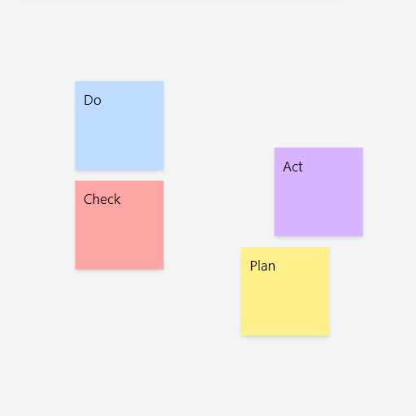
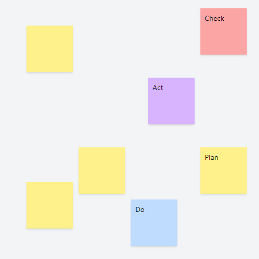

# Paperboard Development Update 1

_2022/08/23_

Since this is our first development update, and we never properly introduced the project
before, we want to give some background on the history of the project before diving into
the current development efforts in our next update.

## Why Paperboard

Like many projects Paperboard started as an experiment in applying a unique set of
design decisions, both on a technical as well as on a user experience level, to a certain
problem domain, in this case a virtual board.

But beyond being an interesting experiment there was one particular reason that we started to build Paperboard.
And that was our frustration in using existing virtual boards to track our product development tasks.

There are many other boards out there and most of them make it easy enough to add content fast.
But managing and reorganizing these elements quickly turns into an exercise in frustration.
We were not satisfied with these existing solutions so we started to experiment.

To that end the prime directive of Paperboard is making it effortless to organize and reorganize
the elements on the virtual board.

## Paperboard UX

One of the original ideas in the first Paperboard prototype was what is nowadays called
"displacement" in the code.
A card will push an element up or down when placed on top of it so elements never overlap.
The primary goal of this functionality was to avoid the annoyance of having to rearrange cards manually.

It works well enough but has its limitations.
We are still considering turning it into a setting.
There are a number of ways it could be improved though but this could be the topic of another development update.

### The Grid

Since the basic card displacement does not really cut it if you want to represent something like a story map
the next idea was the grid.
In its first incarnation the grid was an element that had to be created separately but later we changed
this so it is created automatically if cards collide.

It seems neat but we never added enough functionality for it to actually be usable as a story map and ultimately
we removed the functionality entirely in a recent change in favor of the table.

### The Table

The idea of a table element came very early in the Paperboard project but we had many doubts about the feasibility of the UX we were aiming for. The concept is pretty straightforward, a table can have any number of rows and columns
and every cell can contain any number of elements in arbitrary positions within the cell.

It doesn't seem that hard at first glance but there are a number of interesting edge cases that you need to deal with.
We are still working on improving the table UI, to make it prettier and add some missing features.
But the basic concept works well. We use it daily on our own development board and it has proven effective
in managing our tasks.

We think the table could in the future also gain some features of the grid.

### Imports, Collaboration, and more

There are many more features that are already implemented in Paperboard, like basic data imports from Jira or Linear.
Paperboard is also already a live board that can be collaborated on in real-time as you would expect from such a tool.
We will be writing about these and many more features in more detail in future updates.

## Where are we going?

While you can use the basic cards and elements in Paperboard to track your product development tasks
we don't want to build another issue tracking tool or build backlog items, sprints or anything like
that into Paperboard.

There are many tools out there that already do a great job with that.
But the reality of modern software product development is that there are usually many such tools
in use in a single company, even in a single team.

The downside of most of these tools is their lack of visual nature.
They are mostly built around infinite lists of items which don't afford any size constraints.
And human cognition is fundamentally built on the perception of space and the spatial relationship of objects around us.

This is why we believe there is a lot of value in being able to bring all these diverse sources of information
on a visual board and being able to organize and cross-reference them as you see fit.

Just picture being able to get an overview of all your ongoing work in progress across the whole company.
Or being able to visualize the dependencies between your development teams that are right now hidden inside
tasks in infinite lists that are out-of-sight out-of-mind.

Imagine being able to see all the tasks across departments related to a single product effort,
like marketing, development, operations, etc. all together on the board at the level of detail you need
to understand where you are at.

This is where we think the future of Paperboard lies.

## Follow our Development

You can follow our progress on our own Paperboard board at [paperboard.app/dev](https://paperboard.app/dev).

This is a readonly snapshot of our development board.

You can also follow us on twitter at [twitter.com/paperboardapp](https://twitter.com/paperboardapp).

## Try Paperboard

You can try Paperboard yourself right now at [paperboard.app](https://paperboard.app).

Let us know what you think.
